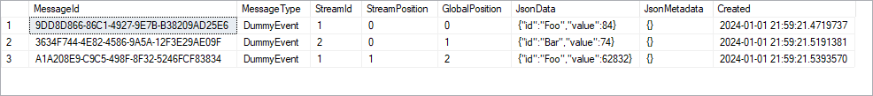
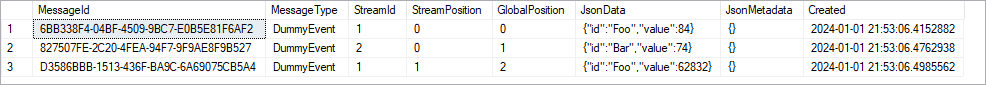

This repository contains a simple ASP .NET Core project that reproduces a bug 
described in https://github.com/Eventuous/eventuous/issues/305.

##### Test conditions
* Operating system: Windows 10 Professional, version 22H2, build 19045.3803
* Database (local): SQL Server Developer (64 bit), version 15.0.2104.1
* Eventuous: version 0.15.0-beta.8.2

##### Usage
Edit the connection string in `Program.cs` to match your local setup, then 
build and run the app. In its default state, the subscription's event handler
does not execute any SQL queries, and the problem behavior does not occur.

If you examine `DUMMY.Messages`, you will see the three events generated via 
the three commands in lines 30-32 of `Program.cs`:



`DUMMY.Streams` and `DUMMY.Checkpoints` look fine as well.


Because the event handler in this state does not execute any SQL queries, 
`DUMMY.Output` is empty.

Finally, the console records each time the event handler runs:

```
Foo: 84
Bar: 74
Foo: 62832
```

All good. Now uncomment line 103 of `DummyAggregate.cs`, so that the event 
handler now executes an insert query, then run the app again. This time, the
event handler runs ***twice*** for each event.

`DUMMY.Messages`, `DUMMY.Streams`, and `DUMMY.Checkpoints` are all still fine:




But there are extra records inserted into `DUMMY.Output`:


and the console shows that the event handler is running twice for each event 
(occasionally, the very first event is not doubled):

```
Foo: 84
Foo: 84
Bar: 74
Bar: 74
Foo: 62832
Foo: 62832
```

I can't think of any reason why the simple act of executing a SQL query could
cause the event handler to run twice. The only thing I can think of is that 
the checkpoint tracking is getting messed up somehow.

Additional testing reveals that running an update query also causes the 
problem to occur.
